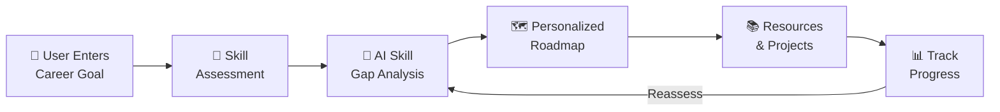

<p align="center">
  <h1 align="center">🚀 SkillPath AI</h1>
  <p align="center">
    <strong>AI-Powered Adaptive Learning Platform — Learn Smarter, Not Harder</strong>
  </p>
  <p align="center">
    <a href="#-key-features">Features</a> •
    <a href="#-tech-stack">Tech Stack</a> •
    <a href="#%EF%B8%8F-installation--setup">Setup</a> •
    <a href="#-how-it-works">How It Works</a> •
    <a href="#-contributing">Contributing</a>
  </p>
</p>

---

## 📖 Introduction

In a world overflowing with online courses and tutorials, learners often struggle to find the **right** content at the **right** time. Most platforms offer a one-size-fits-all approach that ignores what you already know, wastes your time on redundant topics, and leaves you without a clear direction toward your career goals.

**SkillPath AI** changes that. It's an intelligent, adaptive learning platform that **analyzes your existing skills**, **identifies gaps**, and **generates a personalized roadmap** tailored to your target career — so every minute you spend learning actually counts.

----

## 🧩 Problem Statement

Traditional learning platforms suffer from critical shortcomings:

| Challenge | Impact |
|---|---|
| 🔁 **Generic Courses** | Learners repeat topics they already know, wasting valuable time. |
| 🧭 **Unclear Skill Paths** | No structured guidance on *what* to learn and *in what order*. |
| ⏳ **Wasted Learning Time** | Without personalization, learners spend hours on irrelevant content. |
| 📉 **No Progress Insight** | Learners can't measure real skill growth or identify weak areas. |
| 🤷 **Decision Paralysis** | Too many resources with no way to filter by relevance or quality. |

> [!IMPORTANT]
> Studies show that personalized learning can improve outcomes by up to **30%** compared to traditional approaches. SkillPath AI brings this personalization to technical skill development.

---

## 💡 Solution

**SkillPath AI** addresses these challenges through an intelligent, end-to-end learning experience:

- 🎯 **Precision Targeting** — AI-powered skill gap analysis pinpoints exactly what you need to learn.
- 🗺️ **Smart Roadmaps** — Dynamically generated learning paths adapt to your goals and pace.
- 🤖 **AI Mentor** — An always-available assistant for guidance, explanations, and doubt resolution.
- 📚 **Curated Resources** — No more searching — get the best tutorials, docs, and articles recommended for you.
- 🛠️ **Hands-On Projects** — Real-world projects matched to your current skill level.
- 📊 **Progress Tracking** — Visual dashboards to monitor your growth and achievements.

----

## ✨ Key Features

### 1. 🔍 AI Skill Gap Analyzer
Analyzes your current skill set and compares it against the requirements of your target career. Identifies **exactly** which skills you need to acquire, strengthen, or refine.

### 2. 🗺️ Personalized Learning Roadmap
Generates a **step-by-step learning plan** based on your unique skill gaps, career goals, and preferred learning pace. No two roadmaps are alike.

### 3. 🤖 AI Mentor / Chat Assistant
An intelligent chat assistant powered by **AWS Bedrock** that provides:
- Concept explanations and clarifications
- Real-time doubt solving
- Learning guidance and motivation

### 4. 📚 Smart Learning Resource Recommendation
Suggests **curated** tutorials, documentation, articles, and video courses — ranked by relevance to your current learning stage.

### 5. 🛠️ Project-Based Learning
Recommends **real-world projects** calibrated to your skill level, helping you build a portfolio while learning.

### 6. 📊 Progress Tracking Dashboard
A visual dashboard that shows:
- Completed skills and milestones
- Learning streaks and activity
- Overall progress toward your career goal

### 7. 📝 Skill Assessments & Diagnostic Tests
Interactive quizzes and diagnostic tests to:
- Evaluate your initial skill level
- Track improvement over time
- Validate skill mastery

---

## 🏗️ System Architecture

```
┌─────────────────────────────────────────────────────────────┐
│                        CLIENT (Frontend)                    │
│              React 19 · Vite 8 · Tailwind CSS 4             │
│                                                             │
│  ┌──────────┐ ┌──────────┐ ┌───────────┐ ┌──────────────┐  │
│  │ Landing  │ │Dashboard │ │ Skill Gap │ │   AI Mentor  │  │
│  │  Page    │ │  Page    │ │ Analysis  │ │    Chat      │  │
│  └──────────┘ └──────────┘ └───────────┘ └──────────────┘  │
│  ┌──────────┐ ┌──────────┐ ┌───────────┐ ┌──────────────┐  │
│  │  Login   │ │ Register │ │  Course   │ │  Diagnostic  │  │
│  │  Page    │ │  Page    │ │  Views    │ │    Test      │  │
│  └──────────┘ └──────────┘ └───────────┘ └──────────────┘  │
└──────────────────────────┬──────────────────────────────────┘
                           │ REST API (Axios)
                           ▼
┌─────────────────────────────────────────────────────────────┐
│                       SERVER (Backend)                      │
│               Node.js · Express 5 · JWT Auth                │
│                                                             │
│  ┌──────────────┐  ┌───────────────┐  ┌──────────────────┐ │
│  │ Auth Routes  │  │ Course Routes │  │   User Routes    │ │
│  └──────┬───────┘  └───────┬───────┘  └────────┬─────────┘ │
│         ▼                  ▼                   ▼           │
│  ┌──────────────┐  ┌───────────────┐  ┌──────────────────┐ │
│  │    Auth      │  │   Course      │  │     User         │ │
│  │  Controller  │  │  Controller   │  │   Controller     │ │
│  └──────────────┘  └───────────────┘  └──────────────────┘ │
│                                                             │
│  ┌──────────────────────────────────────────────────────┐   │
│  │               AI Controller (AWS Bedrock)            │   │
│  │         Skill Analysis · Roadmap Generation          │   │
│  └──────────────────────────────────────────────────────┘   │
└──────────────────────────┬──────────────────────────────────┘
                           │ Mongoose ODM
                           ▼
┌─────────────────────────────────────────────────────────────┐
│                     DATABASE (MongoDB)                      │
│              User Profiles · Courses · Progress             │
└─────────────────────────────────────────────────────────────┘
```

---

## ⚙️ How It Works



| Step | Description |
|------|-------------|
| **1. Set Your Goal** | Enter your target career or skill (e.g., "Full Stack Developer", "Data Scientist"). |
| **2. Skill Assessment** | Take a diagnostic test to evaluate your current knowledge level. |
| **3. AI Skill Gap Analysis** | The AI engine compares your skills against the target role requirements and identifies gaps. |
| **4. Roadmap Generation** | A personalized, step-by-step learning path is generated — prioritized by importance and prerequisites. |
| **5. Learn & Build** | Follow curated resources, build recommended projects, and get help from the AI Mentor. |
| **6. Track & Improve** | Monitor your progress on the dashboard, retake assessments, and watch your skills grow. |

---

## 🛠️ Tech Stack

### Frontend
| Technology | Purpose |
|---|---|
| **React 19** | Component-based UI library |
| **Vite 8** | Lightning-fast build tool and dev server |
| **Tailwind CSS 4** | Utility-first CSS framework |
| **Framer Motion** | Smooth animations and transitions |
| **React Router v7** | Client-side routing and navigation |
| **Axios** | HTTP client for API communication |
| **Lucide React** | Beautiful icon library |

### Backend
| Technology | Purpose |
|---|---|
| **Node.js** | JavaScript runtime |
| **Express 5** | Web framework for REST APIs |
| **Mongoose 9** | MongoDB ODM for data modeling |
| **JWT** | Secure authentication tokens |
| **bcryptjs** | Password hashing |
| **Google Auth Library** | OAuth 2.0 social login |

### AI / Cloud
| Technology | Purpose |
|---|---|
| **AWS Bedrock** | Managed AI/ML service for skill analysis and mentoring |

### Database
| Technology | Purpose |
|---|---|
| **MongoDB** | NoSQL document database for flexible data storage |

### Dev Tools
| Technology | Purpose |
|---|---|
| **Nodemon** | Auto-restart server on file changes |
| **ESLint** | Code quality and linting |
| **PostCSS** | CSS processing pipeline |

---

## 🖥️ Installation & Setup

### Prerequisites

- **Node.js** v18+ ([Download](https://nodejs.org/))
- **MongoDB** (local or [MongoDB Atlas](https://www.mongodb.com/atlas))
- **Git** ([Download](https://git-scm.com/))
- **AWS Account** with Bedrock access (for AI features)

### 1️⃣ Clone the Repository

```bash
git clone https://github.com/Saurav-Shandilya/SkillPath-AI.git
cd SkillPath-AI
```

### 2️⃣ Setup the Backend

```bash
# Navigate to the server directory
cd server

# Install dependencies
npm install
```

Create a `.env` file inside the `server/` directory:

```env
PORT=5000
MONGODB_URI=your_mongodb_connection_string
JWT_SECRET=your_jwt_secret_key
AWS_ACCESS_KEY_ID=your_aws_access_key
AWS_SECRET_ACCESS_KEY=your_aws_secret_key
AWS_REGION=your_aws_region
```

Start the backend server:

```bash
# Development mode (with auto-reload)
npm run dev

# Production mode
npm start
```

### 3️⃣ Setup the Frontend

```bash
# Navigate to the client directory (from project root)
cd client

# Install dependencies
npm install
```

Create a `.env` file inside the `client/` directory:

```env
VITE_API_URL=http://localhost:5000
VITE_GOOGLE_CLIENT_ID=your_google_client_id
```

Start the frontend dev server:

```bash
npm run dev
```

### 4️⃣ Open the App

Visit **[http://localhost:5173](http://localhost:5173)** in your browser. 🎉

---

## 📁 Project Structure

```
SkillPath-AI/
├── client/                     # 🎨 Frontend (React + Vite)
│   ├── public/                 # Static assets
│   ├── src/
│   │   ├── assets/             # Images, icons, fonts
│   │   ├── components/         # Reusable UI components
│   │   │   ├── AIMentor.jsx    #   AI chat assistant component
│   │   │   ├── GoogleLoginBtn.jsx  # Google OAuth button
│   │   │   └── Layout.jsx      #   App layout wrapper
│   │   ├── pages/              # Page-level components
│   │   │   ├── Landing.jsx     #   Landing / homepage
│   │   │   ├── Login.jsx       #   Login page
│   │   │   ├── Register.jsx    #   Registration page
│   │   │   ├── Dashboard.jsx   #   User dashboard
│   │   │   ├── SkillGapAnalysis.jsx  # Skill gap analysis page
│   │   │   ├── CourseGeneration.jsx  # AI course generation
│   │   │   ├── CourseView.jsx  #   Course content viewer
│   │   │   ├── NewCourse.jsx   #   Create new course
│   │   │   ├── DiagnosticTest.jsx  # Skill diagnostic test
│   │   │   └── Profile.jsx     #   User profile page
│   │   ├── App.jsx             # Root app component & routing
│   │   ├── App.css             # Global app styles
│   │   ├── index.css           # Base styles & Tailwind imports
│   │   └── main.jsx            # App entry point
│   ├── index.html              # HTML template
│   ├── package.json            # Frontend dependencies
│   ├── vite.config.js          # Vite configuration
│   ├── tailwind.config.js      # Tailwind CSS configuration
│   └── postcss.config.js       # PostCSS configuration
│
├── server/                     # ⚙️ Backend (Node.js + Express)
│   ├── src/
│   │   ├── controllers/        # Request handlers
│   │   │   ├── aiController.js     # AI/ML operations (Bedrock)
│   │   │   ├── authController.js   # Authentication logic
│   │   │   ├── courseController.js  # Course CRUD operations
│   │   │   └── userController.js   # User profile management
│   │   ├── middleware/         # Express middleware
│   │   │   └── authMiddleware.js   # JWT authentication guard
│   │   ├── models/             # Mongoose schemas
│   │   │   ├── User.js            # User data model
│   │   │   └── Course.js          # Course data model
│   │   ├── routes/             # API route definitions
│   │   │   ├── authRoutes.js      # /api/auth/*
│   │   │   ├── courseRoutes.js     # /api/courses/*
│   │   │   └── userRoutes.js      # /api/users/*
│   │   └── server.js          # Express app entry point
│   └── package.json            # Backend dependencies
│
├── .gitignore                  # Git ignore rules
└── README.md                   # 📄 You are here!
```

---

## 📸 Screenshots

> Screenshots and UI previews will be added here as the project evolves.

| Screen | Preview |
|--------|---------|
| **Landing Page** | *Coming soon* |
| **Dashboard** | *Coming soon* |
| **Skill Gap Analysis** | *Coming soon* |
| **AI Mentor Chat** | *Coming soon* |
| **Course View** | *Coming soon* |
| **Diagnostic Test** | *Coming soon* |

---

## 🔮 Future Scope

| Feature | Description |
|---------|-------------|
| 🔮 **AI Career Path Predictor** | Predict the best career path based on your skills, interests, and market trends. |
| 📝 **AI Project Evaluator** | Automatically evaluate submitted projects and provide detailed feedback. |
| 💻 **Coding Interview Simulator** | AI-driven mock interviews with real-time feedback and scoring. |
| 📄 **ATS-Friendly Resume Builder** | Generate optimized resumes tailored to specific job descriptions. |
| 🔗 **Job Platform Integration** | Connect with LinkedIn, Indeed, and other platforms for job recommendations. |
| 👥 **Community Learning Platform** | Peer-to-peer learning, study groups, and collaborative projects. |

---

## 🤝 Contributing

Contributions are what make the open-source community amazing! Any contributions you make are **greatly appreciated**.

### How to Contribute

1. **Fork** the repository
2. **Clone** your fork locally
   ```bash
   git clone https://github.com/your-username/SkillPath-AI.git
   ```
3. **Create** a feature branch
   ```bash
   git checkout -b feature/amazing-feature
   ```
4. **Make** your changes and commit
   ```bash
   git commit -m "feat: add amazing feature"
   ```
5. **Push** to your branch
   ```bash
   git push origin feature/amazing-feature
   ```
6. **Open** a Pull Request

### Contribution Guidelines

- Follow the existing code style and conventions
- Write clear, descriptive commit messages (use [Conventional Commits](https://www.conventionalcommits.org/))
- Update documentation for any new features
- Ensure all existing tests pass before submitting a PR
- Add tests for new functionality when applicable

> [!TIP]
> Check the [Issues](https://github.com/Saurav-Shandilya/SkillPath-AI/issues) tab for open tasks and feature requests. Look for issues labeled `good first issue` to get started!

---

## 📄 License

This project is licensed under the **MIT License** — see the [LICENSE](LICENSE) file for details.

```
MIT License

Copyright (c) 2026 SkillPath AI

Permission is hereby granted, free of charge, to any person obtaining a copy
of this software and associated documentation files (the "Software"), to deal
in the Software without restriction, including without limitation the rights
to use, copy, modify, merge, publish, distribute, sublicense, and/or sell
copies of the Software, and to permit persons to whom the Software is
furnished to do so, subject to the following conditions:

The above copyright notice and this permission notice shall be included in all
copies or substantial portions of the Software.

THE SOFTWARE IS PROVIDED "AS IS", WITHOUT WARRANTY OF ANY KIND, EXPRESS OR
IMPLIED, INCLUDING BUT NOT LIMITED TO THE WARRANTIES OF MERCHANTABILITY,
FITNESS FOR A PARTICULAR PURPOSE AND NONINFRINGEMENT. IN NO EVENT SHALL THE
AUTHORS OR COPYRIGHT HOLDERS BE LIABLE FOR ANY CLAIM, DAMAGES OR OTHER
LIABILITY, WHETHER IN AN ACTION OF CONTRACT, TORT OR OTHERWISE, ARISING FROM,
OUT OF OR IN CONNECTION WITH THE SOFTWARE OR THE USE OR OTHER DEALINGS IN THE
SOFTWARE.
```

---

<p align="center">
  Made with ❤️ by the <strong>SkillPath AI</strong> team
  <br />
  <sub>⭐ Star this repo if you find it useful!</sub>
</p>
